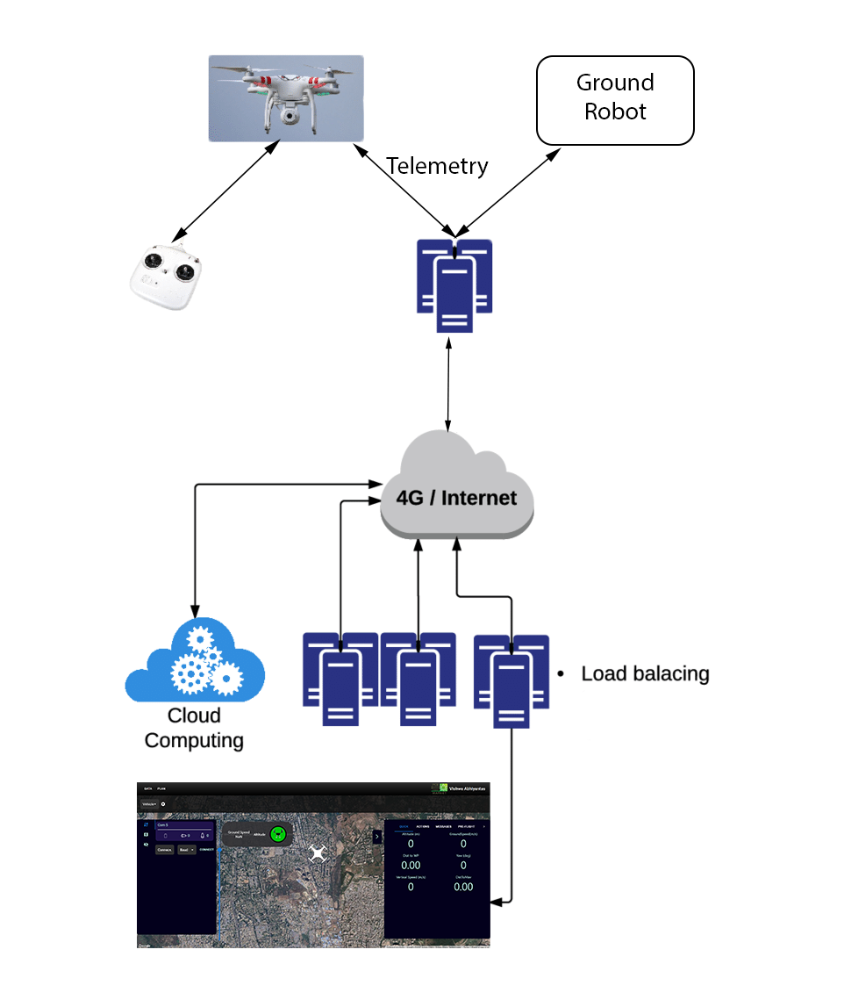
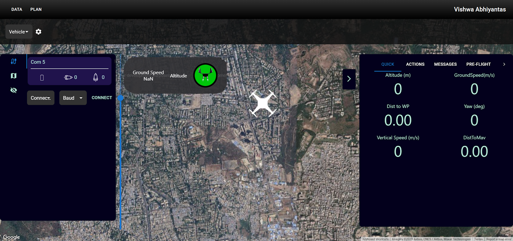

# Mavlink Drone Remote Control Platform

This project enables remote control and monitoring of drones using a telemetry-based on-site server, a Python MAVLink interface, and a Node.js WebSocket server. The system streams real-time drone data to all connected users via a modern React web interface.

## Architecture



## Frontend Glimpse



## Features

- **Remote Drone Control:** Send commands and receive telemetry from drones using MAVLink protocol.
- **Real-Time Data Sharing:** All connected users receive live drone data via WebSockets.
- **Multi-User Web Interface:** Modern React frontend with 3D drone visualization, Google Maps integration, and telemetry panels.
- **Modular Backend:** Python handles MAVLink communication; Node.js manages WebSocket connections and relays data between Python and frontend clients.

## Architecture

```
[Drone] ←→ [Python MAVLink Script] ←→ [Node.js WebSocket Server] ←→ [React Web App]
```

- **Python (`server/pythonScripts/`):** Connects to the drone using MAVLink, processes telemetry, and communicates with the Node.js server via WebSockets.
- **Node.js (`server/server.js`):** Acts as a relay between the Python backend and all web clients.
- **React Frontend (`src/`):** Displays drone status, telemetry, and 3D visualization to users.

## Getting Started

### Prerequisites

- Node.js (v18+ recommended)
- Python 3.7+
- [pymavlink](https://github.com/ArduPilot/pymavlink) and [dronekit](http://python.dronekit.io/) (for Python backend)
- npm (for frontend and server)

### Installation

1. **Clone the repository:**
   ```sh
   git clone https://github.com/yourusername/mavlink-drone.git
   cd mavlink-drone
   ```

2. **Install Node.js dependencies:**
   ```sh
   npm install
   cd server
   npm install
   ```

3. **Install Python dependencies:**
   ```sh
   pip install pymavlink dronekit asyncio websockets
   ```

### Running the System

1. **Start the Python MAVLink server:**
   ```sh
   cd server/pythonScripts
   python main2.py
   ```

2. **Start the Node.js WebSocket server:**
   ```sh
   cd server
   npm start
   ```

3. **Start the React frontend:**
   ```sh
   npm start
   ```

4. **Open your browser at** [http://localhost:3000](http://localhost:3000)

## File Structure

- `src/` — React frontend (UI, 3D model, Google Maps, etc.)
- `server/server.js` — Node.js WebSocket relay server
- `server/pythonScripts/` — Python MAVLink interface scripts

## Contributing

Pull requests are welcome! For major changes, please open an issue first to discuss what you would like to change.